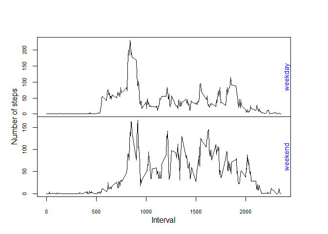

## Loading and preprocessing the data

First, we will download the data into a folder called repdata using ```download.file()``` and ```unzip()```. Then, we can read the data into R using ```read.csv()```.


```r
## Creates the repdata folder and unzips downloaded zip folder to repdata
if(!file.exists("./repdata")) {
  dir.create("./repdata")
  
  temp <- tempfile()
  fileUrl <- "https://d396qusza40orc.cloudfront.net/repdata%2Fdata%2Factivity.zip"
  download.file(fileUrl, destfile = temp)
  dateDownloaded <- format(Sys.time(), "%a %b %d %Y %X")
  unzip(temp, exdir = "./repdata")
  unlink(temp)
  }

## Reads the data into R
setwd("./repdata")
csvFile <- "activity.csv"
activity <- read.csv(csvFile)
```


## What is the mean total number of steps taken per day?

In order to visually represent the mean total number of steps taken each day, we will make a histogram of the total number of steps taken each day. Then, we will calculate the mean and the median total number of steps taken per day.


```r
## Plots a histogram of the total steps for each day
library(ggplot2)
activity2 <- transform(activity, date = as.Date(date))
total <- aggregate(. ~ date, data = activity2, sum)
dateCount <- data.frame(date = rep(total$date, total$steps))

ggplot(dateCount, aes(x = date)) + geom_histogram()
```

<!-- -->

```r
avg <- mean(total$steps, na.rm = T)
med <- median(total$steps, na.rm = T)
```

The mean is 1.0766189\times 10^{4}, and the median is 10765.


## What is the average daily activity pattern?

To visualize the average daily activity pattern, we ought to make a time series plot of average number of steps vs. 5-minute time intervals. Thereafter, we can determine which 5-minute interval contains the maximum number of steps on average.


```r
## Average Steps vs. Interval Line Plot
intervalAverages <- aggregate(steps ~ interval, data = activity2, mean)
plot(intervalAverages, type = "l")
```

<!-- -->

```r
## Maximum number of steps on average
max(intervalAverages, na.rm = T)
```

```
## [1] 2355
```


## Imputing missing values

Here, we will calculate the number of NA values and replace each NA value with the average step count for that particular 5-minute interval. The new dataset will be identical to the old one but with the missing values filled in.


```r
## Number of NA values for steps variable
sum(!complete.cases(activity2$steps)) # number of NA values
```

```
## [1] 2304
```

```r
## Replaces NA values with mean for that 5-minute interval
activity3 <- activity2 # creates a copy
NAind <- which(!complete.cases(activity3$steps)) # NA indices
intervals <- activity3$interval[NAind] # selects intervals of NA values
cond <- match(intervals, intervalAverages$interval) # matches intervals to indices
means <- intervalAverages[cond, "steps"] # average step count for each interval instance
activity3$steps[NAind] <- means # replaces NA values with appropriate mean
```

Now, let's make a histogram of the new dataset. Then, we will calculate the mean and median total number of steps taken per day.


```r
# library(ggplot2)
df <- activity3 # shortened name to save time typing
dfTotal <- aggregate(. ~ date, data = df, sum)
dfDateCount <- data.frame(date = rep(dfTotal$date, dfTotal$steps))

ggplot(dfDateCount, aes(x = date)) + geom_histogram()
```

<!-- -->

```r
dfavg <- mean(dfTotal$steps, na.rm = T)
dfmed <- median(dfTotal$steps, na.rm = T)
```
The mean is 1.0766189\times 10^{4}, and the median is 1.0766189\times 10^{4}.

### Impact of imputing data

When we compare this histogram to the previous histogram, we can see that the values differ from the estimates from the first portion of the assignment. Imputing missing data on the estimates of the total daily number of steps may result in the introduction of noise or bias to the dataset. This process may result in unique inaccuracies in analysis of the data that possibly would not arise in a dataset with removed NA values.


## Are there differences in activity patterns between weekdays and weekends?

Here, we will use the dataset we used to impute data, from the previous section. Making a time series panel plot can be useful in displaying the activity with respect to the day of the week; we can determine whether any differences in activity patterns exist between weekdays and weekends.


```r
## Assigns weekdays and weekends to date variable
wkdays <- c("Monday", "Tuesday", "Wednesday", "Thursday", "Friday")
wkends <- c("Saturday", "Sunday")
x <- weekdays(df$date)
dfFac <- factor(x, levels = c(wkdays, wkends),
                labels = c(rep("weekday", 5), rep("weekend", 2)))
df2 <- transform(df, partOfWeek = dfFac)

## Take interval averages across all weekday days and weekend days
intAvg <- aggregate(steps ~ interval + partOfWeek, data = df2, mean)

## Creates simple panel plot
par(mfrow = c(2, 1))
par(mar = c(0, 0, 0, 0), oma = c(4, 4, 4, 4))
plot(intAvg[1:288, c(1, 3)], type = "l", xlab = "", xaxt = "n", cex.axis = 0.7)
mtext("weekday", side = 4, line = -1, col = "blue", cex = 0.85)
mtext("Number of steps", side = 2, line = 2, outer = T)
plot(intAvg[289:576, c(1, 3)], type = "l", cex.axis = 0.7)
mtext("weekend", side = 4, line = -1, col = "blue", cex = 0.85)
mtext("Interval", side = 1, line = 2, outer = T)
```

<!-- -->

